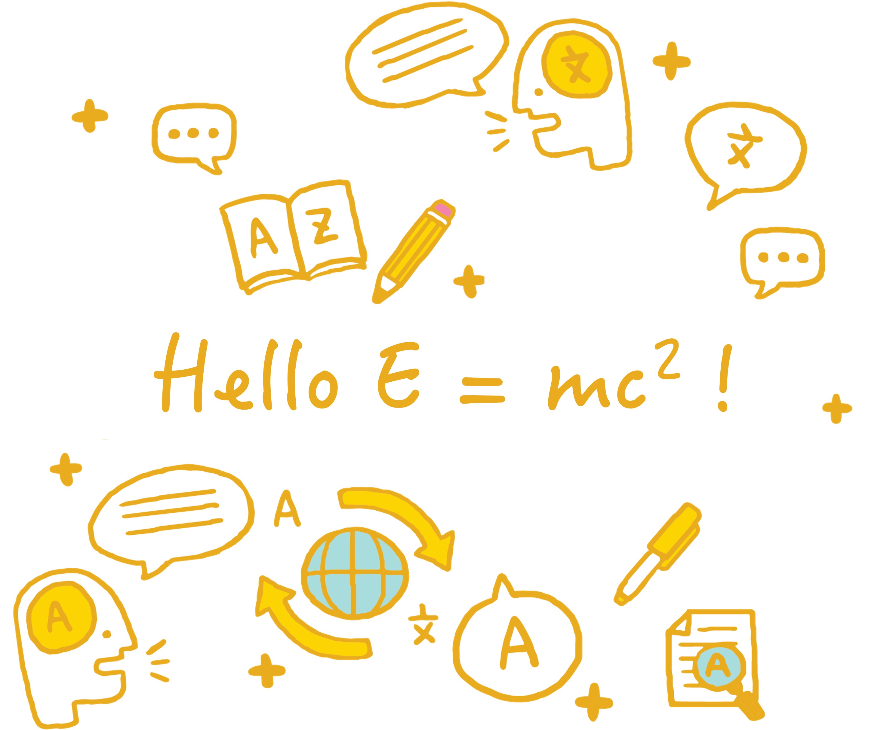

## AI4Sci Education 
I think it is equally important to perform the cutting-edge research by myself and to help the growth of next generation of researchers. I'm currently collaborating with PalmDrive Education as a scientic mentor and working closely with talented college students on **AI4Sci** and/or **quantum sciences**. 

**Collaborator needed**: I'm keen to explore how to better perform education for AI4Sci. Since I only have science backgrounds, I'm also willing to collaborate with other researchers, esp. ones with education backgrounds, on this topic!

**Community**: Please also checkout & contribute any ideas the [AI4Sci Education org](https://github.com/AI4SciEdu) founded by me on GitHub, the corresponding website is [AI4Sci Education](https://ai4sciedu.github.io)

**Courses/research oppotunity**: Any college/high-school students are welcome to work with me on reasonable projects. If you have interests, please contact via [PalmDrive](https://palmdrive.cn) Or direct contact me via sherrylixuecheng@gmail.com

## Opensource software developments
I'm a contributor to an opensource software, [MathTranslate](https://github.com/SUSYUSTC/MathTranslate). This is a project to provide translation of scientific papers with heavy math symbols from any language to any language while keeping the math symbols unchanged. More can be found from [Jiace's personal page](https://susyustc.github.io/mathtranslate/)

