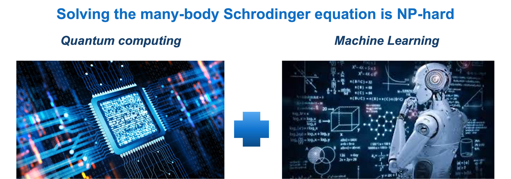
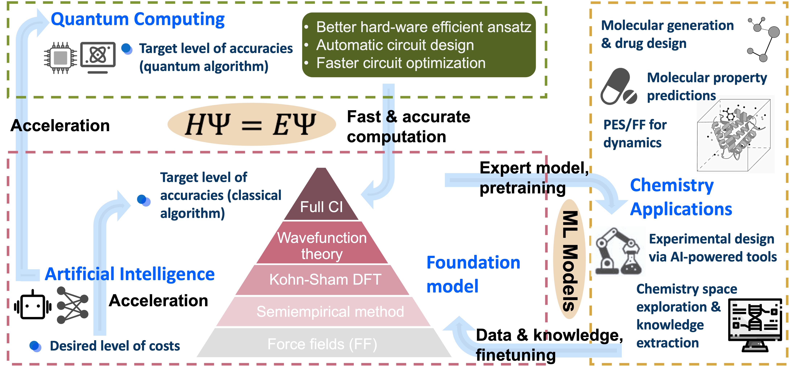
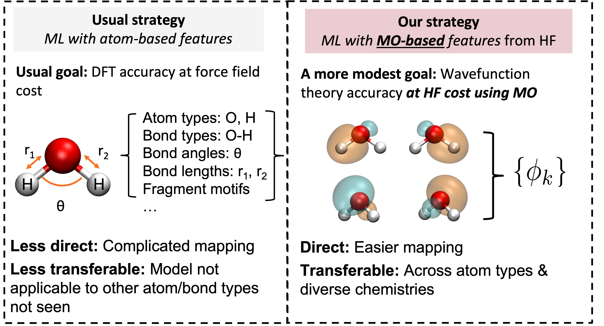

I'm working at [Microsoft Research](https://www.microsoft.com/en-us/research/) as a researcher on DeepQMC for electronic structure. I graduated with [Prof. Thomas F. Miller III](https://millergroup.caltech.edu/Miller_Group/Home.html/) @ [CCE, Caltech](http://cce.caltech.edu/) in 2022 on AI for quantum chemistry (MOB-ML). Before joining [Microsoft Research AI4Science lab](https://www.microsoft.com/en-us/research/lab/microsoft-research-ai4science/), I was a researcher working on the interdisplinary studies between quantum sciences & machine learning in Tencent Quantum Lab for around 9 months. The topics/projects I am working/worked on are listed as below.

Microsoft Research work:
---
### AI for chemistry
Deep Quantum Monte Carlo for Electronic Structure\\
[1] **Cheng, L.**\*; Szabó, P.B.\*; Schätzle, Z.\*; Kooi, D.; Köhler, J.; Noé, F.; Gori-Giorgi, P.; Foster, A. Highly Accurate Real-space Electron Densities with Neural Networks, arXiv:2409.01306.(\*co-first author)[Link](https://arxiv.org/abs/2409.01306)

LLMs for Scientific Discovery: Evaluate and explore the ability of LLMs in many scientific tasks.\\
[1] MR AI4Science^, MA Quantum. The Impact of Large Language Models on Scientific Discovery: a Preliminary Study using GPT-4. arXiv:2311.07361 (2023).[Link](https://arxiv.org/abs/2311.07361) (^Main contributor to Chapter 4, see Authorship and contribution list) 

Other independent work:
---
### AI for quantum computing & Quantum machine learning:
The goal is to apply the state-of-the-art ML tools to facilitate more efficient quantum algorithm realizations and quantum resource usages.

[1] **Cheng, L.**\*; Chen, Y.-Q.\*; Zhang, S.-X.; Zhang, S. Error-mitigated quantum approximate optimization via learning-based adaptive optimization. (\*co-first author) arXiv:2303.14877 (2023).[Link](https://arxiv.org/abs/2303.14877)

### AI for biology: Bayesian Optimization for experimental design
[1] **Cheng, L.**\*; Yang, Z\*; Liao, B; Hsieh, C; Zhang, S. ODBO: Bayesian optimization with search space prescreening for directed protein evolution. [Link](https://arxiv.org/abs/2205.09548)

### Quantum computing for quantum chemistry
[1] Sun, J.; **Cheng, L.**; Li, W. Towards chemical accuracy with shallow quantum circuits: A Clifford-based Hamiltonian engineering approach.  *J. Chem. Theory Comput.*, **2024**.[Link](https://pubs.acs.org/doi/10.1021/acs.jctc.3c00886)

[2] Li, W; Allcock, J.; **Cheng, L.**; Zhang, S.-X.; Chen, Y.-Q.; Mailoa, J.P.; Zhang, S. TenCirChem: An efficient quantum computational chemistry package for the NISQ era. *J. Chem. Theory Comput.*, **2023**.[Link](https://pubs.acs.org/doi/abs/10.1021/acs.jctc.3c00319)

Caltech work:
---
### AI for electronic structure: MOB-ML

Quantum simulation is a is a powerful tool for chemists to understand the chemical processes and discover their nature accurately by expensive wavefunction theory (WFT) or approximately by cheap density function theory (DFT). However, the cost-accuracy trade-offs in electronic structure methods limit the application of quantum simulation to large chemical and biological systems. An accurate, transferable, and physical-driven molecular modelling framework, i.e., molecular orbital based machine learning (MOB-ML), is introduced to provide accurate wavefunction-quality molecular descriptions with at most DFT level computational cost. Preserving all the physical constraints, MOB features represent the chemical space faithfully in both *supervised learning* for molecular property by scalable exact Gaussian processes and *unsupervised learning* for chemical space explorations. MOB-ML is not only the most accurate method in the low data regime, but also scalable to big data modelling to provide a universal density matrix functional. As an exciting and general new tool to tackle various problems in chemistry, MOB-ML offers great accuracies of predicting total energies of organic and transition-metal containing molecules, non-covalent interactions in the protein backbone-backbone, and transition-state energies. The availability of analytical gradient of MOB-ML opens an avenue of applying MOB-ML to provide accurate potential energy surfaces (PESs) for molecular dynamics simulations.

**Selected publications:**

[1]  **Cheng, L.**; Sun, J.; Deustua, J. E.; Bhethanabotla, V. C.; Miller III, T. F. Molecular-orbital-based machine learning for open-shell and multi-reference systems with kernel addition Gaussian process regression. *J. Chem. Phys.*, **2022**. [Link](https://aip.scitation.org/doi/10.1063/5.0110886)

[2] Lu, F.\*; **Cheng, L.**\*; DiRisio, R. J.\*; Finney, J. M.; Boyer, M. A.; Lu, F.; Moonkaen, P.; Sun, J.; Lee, S. J. R.; Deustua, J. E.; Miller III, T. F.; McCoy, A. B. Fast near ab initio potential energy surfaces using machine learning. *J. Phys. Chem. A*, **2022**. (\*co-first author) [Link](https://pubs.acs.org/doi/abs/10.1021/acs.jpca.2c02243)

[3] **Cheng, L.**; Kovachki, N; Welborn, M.; Miller III, T. F. Regression clustering for improved accuracy and training costs with molecular-orbital-based machine learning. J. Chem. Theory Comput., 2019. [Link](https://pubs.acs.org/doi/abs/10.1021/acs.jctc.9b00884)

[4] **Cheng, L.**; Welborn, M.; Miller III, T. F. A universal density matrix functional from molecular orbital-based machine learning: Transferability across organic molecules. J. Chem. Phys., 2019. [Link](https://aip.scitation.org/doi/full/10.1063/1.5088393)

[5] Welborn, M.; **Cheng, L.**; Miller III, T. F. Transferability in machine learning for electronic structure via the molecular orbital basis. J. Chem. Theory Comput. 2018. [Link](https://pubs.acs.org/doi/abs/10.1021/acs.jctc.8b00636) (Highlighted with commentary in [C&EN](https://cen.acs.org/physical-chemistry/computational-chemistry/Machine-learning-predicts-electronic-properties/96/web/2018/08) and [Caltech News](http://www.caltech.edu/news/researchers-put-ai-work-making-chemistry-predictions-83357))

### AI for biology: INSPIRE
Predict the thermaldynamics properties of nucleic acids using their secondary structures.
